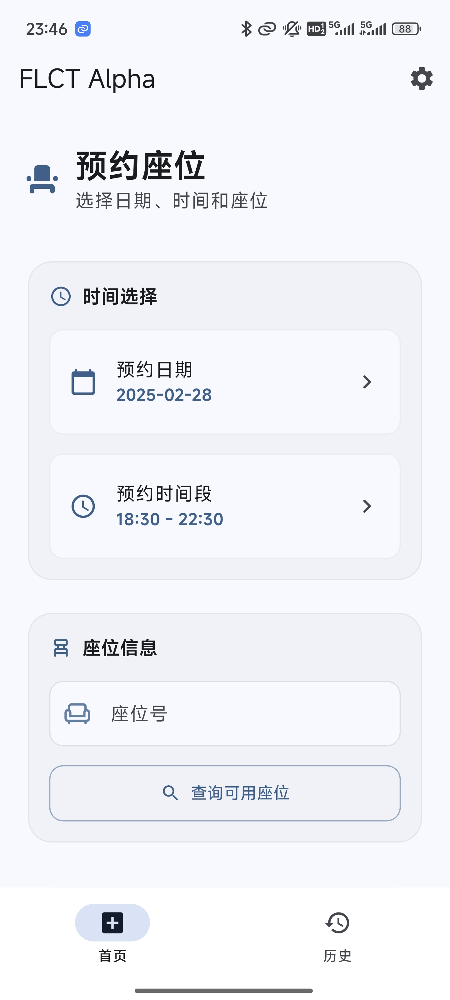

# FLCT - FZU Learning Center Tools

> [!IMPORTANT]
>
> 1. 请勿滥用，本项目仅用于学习和测试！
> 2. 利用本项目提供的接口、文档等造成不良影响及后果与本人无关
> 3. 本项目仍处于 Alpha 阶段，可能存在较多问题，欢迎提出建议和意见

## 软件下载

目前仅提供 安卓 版本，可以在 [Releases](https://github.com/Seeridia/FLCT/releases) 中下载，在可预见的未来会支持 Windows 版本，在可预见的未来**不会**支持 iOS 版本

## 说明

本项目 Alpha 阶段暂不开放源代码（~~实际上是刚学 Flutter，目前做得一坨，没脸看~~），但目前已提供了接口文档与一个功能更完善 python 版本，可以自行开发

- API 文档：[api.seeridia.top](https://api.seeridia.top/)
- Python 版：[flct-py](https://github.com/Seeridia/fzu-learning-center-tool)

目前仅有功能

1. 预约座位（可预约最高 4.5 小时的座位）
2. 个人预约历史查询
3. 取消预约
4. 一键签到（无需扫码）
5. 签退

目前暂没有查询座位预约情况与座位地图的功能，在不可预见的未来会加入

## 看看样子

（~~对不起，那么多的取消纯粹是为了测试~~，实际上没有浪费过一次座位！）